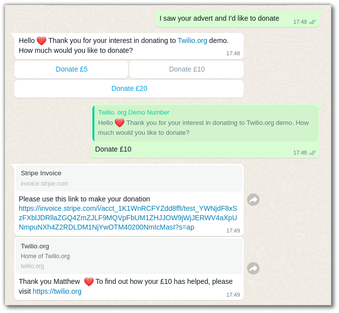

# Twilio WhatsApp Quick Charity Donation Flow

To see a live demo of this, scan the QR code below with your mobile phone. It will open WhatsApp with a prepopulated message that you can send.

This demo is linked to a *test* Stripe account, so when you are presented with an invoice link you can click "pay" and the example credit card number [4242 4242 4242 4242](https://stripe.com/docs/testing) will be used. No real payment is taken.

Follow the prompts through the conversation like this:

## Implementation details

This is powered by [Twilio Functions](https://www.twilio.com/docs/runtime/functions) and a Stripe account, there is no need for you to provide a server, a database, or anything else. There are 2 functions, which total around 200 lines of code.

The first Function handles all incoming messages to the WhatsApp number and creates an invoice on Stripe. The second is triggered by Stripe on an `invoice.paid` event to send the "Thank you" message.

### Requirements

  - A [Stripe account](https://dashboard.stripe.com/register)
  - A WhatsApp enabled Twilio number ([product page](https://www.twilio.com/whatsapp))
  - A WhatsApp template for that number ([example](./whatsapp-message-template.png)) - this needs manual approval from WhatsApp, which takes ~24 hours in my experience.
  - A Twilio Functions Service

### How to deploy this to your own Twilio/Stripe account

#### Adding the Twilio Functions

Create a [new Functions Service](https://www.twilio.com/docs/runtime/functions/create-service)

In the Functions Service, create a *protected* function with a path of `/create-donation-invoice`. Use [this code](./functions/create-donation-invoice.js) as the content of that function.

This function is used to handle incoming messages to the WhatsApp number, so you need to configure that by copying its URL (click the 3 dots next to the function name) and pasting it as the "Webhook URL for incoming messages" in your Twilio console under Messaging>Senders>WhatsApp Senders>Your WhatsApp number.

Also create a *public* function with a path of `/invoice-paid` and content from [here](./functions/invoice-paid.js).

This function is called by Stripe on `invoice.paid` events, so again you need to copy its URL and [set up a webhook in your Stripe account](https://stripe.com/docs/webhooks/quickstart) on `invoice.paid`. Remember that your Stripe account should be in _test_ mode when you set this up.

In your Twilio Functions service, you need to add a dependency on `stripe`. You can leave the version field blank to get the latest version. You also need to set an environment variable called `STRIPE_SECRET_KEY` with [your *test* API key from Stripe](https://stripe.com/docs/keys). Also check the box to "Add my Twilio Credentials" to the environment variables.

#### Initiating the conversation

Sending any message which does not start with "Donate" to the WhatsApp number will start the flow. You can hand out the number, or share it on social media. WhatsApp also supports a URL scheme which lets you use [QR codes](https://faq.whatsapp.com/general/contacts/about-whatsapp-qr-codes/?lang=en) to open the app with a pre-populated message. The URL encoded in the QR code above is: `https://wa.me/447883306036?text=I%20saw%20your%20advert%20and%20I%27d%20like%20to%20donate`

You can customise this for any number and with any text (remembering to URL encode it), and use any QR code generator you like to encode your URL. I used [https://www.qr-code-generator.com/](https://www.qr-code-generator.com/).

## Privacy Note

No [PII](https://en.wikipedia.org/wiki/Personal_data) is stored directly in this app, but customers' phone numbers will be in your Twilio message history and WhatsApp names and phone numbers are stored in your Stripe invoice history. This flow would therefore need a link to a privacy policy if used in a country where GDPR or similar laws apply.

## See Also

  - A similar flow based on SMS rather than WhatsApp [here](https://www.twilio.com/code-exchange/mobile-payment-sms-stripe)
